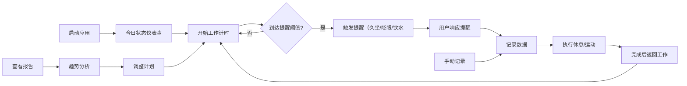

## 1. 产品概述

面向长时间伏案工作的设计师群体的桌面健康管理客户端，帮助用户管理坐姿、用眼健康和休息节奏，预防职业健康问题。

- 核心目标：通过智能提醒和科学引导，改善设计师的工作习惯，减少颈椎病、干眼症、腰背痛等职业疾病风险
- 目标用户：长时间伏案工作的设计师、程序员、文案工作者等办公室人群
- 市场价值：填补针对创意工作者的细分健康管理工具市场空白

## 2. 核心功能

### 2.1 用户角色

| 角色 | 注册方法 | 核心权限 |
|------|----------|----------|
| 普通用户 | 本地使用，无需注册 | 使用所有功能，本地数据存储 |

### 2.2 功能模块

1. **今日状态**：核心数据仪表盘，展示今日健康数据概览
2. **休息计划**：番茄工作法、工作时段设置、休息提醒
3. **姿势记录**：坐姿记录、疼痛程度记录、屏幕距离自评
4. **眼保健操**：眼部运动指导、眨眼提示、用眼时长统计
5. **拉伸动作**：颈肩拉伸动画、手腕放松指导
6. **趋势报告**：周趋势图、习惯达成率、疲劳问卷分析
7. **提醒设置**：各类提醒配置、异常连续提醒、静音专注模式

### 2.3 页面详情

| 页面名称 | 模块名称 | 功能描述 |
|----------|----------|----------|
| 今日状态 | 数据概览 | 久坐时长、休息次数、饮水量、眨眼次数统计卡片 |
| 今日状态 | 实时状态 | 当前坐姿状态、用眼时长、距离下次休息倒计时 |
| 今日状态 | 快捷操作 | 一键开始休息、记录姿势、快速问卷入口 |
| 休息计划 | 番茄钟 | 25分钟工作+5分钟休息循环，可自定义时长 |
| 休息计划 | 工作时段 | 设置每日工作开始/结束时间 |
| 休息计划 | 久坐计时 | 连续久坐提醒，强制休息机制 |
| 休息计划 | 饮水提醒 | 定时提醒喝水，记录每日饮水量 |
| 姿势记录 | 坐姿记录 | 手动记录当前坐姿状态（正确/需调整） |
| 姿势记录 | 疼痛记录 | 颈肩腰疼痛程度1-10级评分 |
| 姿势记录 | 屏幕距离 | 自评屏幕距离（太近/适中/太远） |
| 眼保健操 | 眼部运动 | 6节眼保健操动画指导，每节30秒 |
| 眼保健操 | 眨眼提示 | 定时提醒眨眼，预防干眼症 |
| 眼保健操 | 用眼统计 | 今日连续用眼时长、20-20-20法则提醒 |
| 拉伸动作 | 颈肩拉伸 | 8个颈肩拉伸动作，动画演示每个30秒 |
| 拉伸动作 | 手腕放松 | 5个手腕放松动作，缓解鼠标手 |
| 拉伸动作 | 全身拉伸 | 腰部、背部拉伸指导 |
| 趋势报告 | 周趋势图 | 7天健康数据折线图展示 |
| 趋势报告 | 达成率 | 各项习惯周达成率环形图 |
| 趋势报告 | 疲劳问卷 | 每日疲劳度自评，趋势分析 |
| 趋势报告 | 数据导出 | 导出CSV格式健康数据 |
| 提醒设置 | 提醒配置 | 各类提醒开关、时长、间隔设置 |
| 提醒设置 | 异常提醒 | 连续异常行为加强提醒机制 |
| 提醒设置 | 专注模式 | 静音免打扰时段设置 |
| 提醒设置 | 计划调整 | 根据历史数据智能推荐计划调整 |

## 3. 核心流程

## 4. 用户界面设计

### 4.1 设计风格

- **主色调**：柔和薄荷绿 (#4ECDC4) 作为主色，代表健康与活力
- **辅助色**：温暖珊瑚橙 (#FF6B6B) 用于提醒和强调，深靛蓝 (#2C3E50) 作为文字主色
- **背景色**：柔和米灰渐变背景，减少视觉疲劳
- **按钮风格**：圆角胶囊按钮，柔和阴影，悬停时有微缩放和光晕效果
- **字体**：标题使用"Noto Sans SC"，正文使用系统无衬线字体
- **布局风格**：卡片式布局，7个功能窗口采用标签页切换
- **图标风格**：线性简约图标，配合柔和色彩填充

### 4.2 页面设计概述

| 页面名称 | 模块名称 | UI元素 |
|----------|----------|--------|
| 今日状态 | 数据概览 | 4个数据卡片网格布局，渐变色进度环，微动效 |
| 今日状态 | 实时状态 | 大字号倒计时，动态脉冲指示当前状态 |
| 休息计划 | 番茄钟 | 圆形进度环，开始/暂停/重置按钮 |
| 休息计划 | 时段设置 | 时间选择器，可视化时间轴 |
| 姿势记录 | 疼痛评分 | 1-10级滑动条，表情指示 |
| 眼保健操 | 运动指导 | 大尺寸动画区域，步骤指示，倒计时 |
| 拉伸动作 | 动画演示 | SVG动画人物，动作名称，呼吸节奏指示 |
| 趋势报告 | 周趋势图 | Chart.js折线图，7日数据对比 |
| 趋势报告 | 达成率 | 环形进度图，百分比展示 |
| 提醒设置 | 配置面板 | 开关组，滑块，下拉选择 |

### 4.3 响应性

- 桌面端优先设计，窗口支持最小尺寸800x600，支持自适应调整
- 标签页导航在顶部，支持键盘快捷键切换

### 4.4 动画与交互

- 页面切换采用淡入淡出+滑动过渡动画
- 数据卡片加载时采用错峰上浮动画
- 提醒弹窗采用弹性缩放出现动画
- 拉伸动画采用SVG帧动画或Lottie风格动画
- 按钮悬停微缩放+光晕效果
- 进度环采用平滑过渡动画
