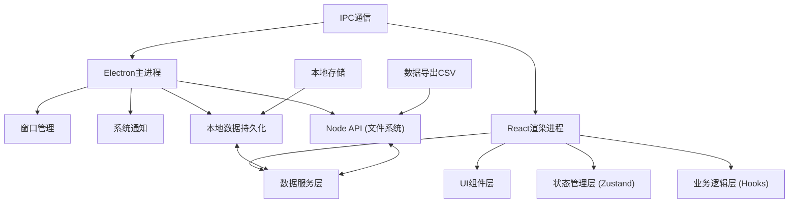

## 1. 架构设计



## 2. 技术描述

- **前端框架**：React@18 + TypeScript
- **构建工具**：Vite@5
- **桌面框架**：Electron@28 + electron-builder
- **状态管理**：Zustand@4（轻量级状态管理，适合桌面应用）
- **样式方案**：TailwindCSS@3 + CSS变量 + Framer Motion（动画）
- **图表库**：Chart.js@4 + react-chartjs-2
- **图标库**：Lucide React
- **数据持久化**：electron-store（基于JSON文件）
- **音频播放**：HTML5 Audio API
- **数据导出**：原生文件系统API

## 3. 窗口/页面定义

| 窗口名称 | 组件路径 | 功能说明 |
|----------|----------|----------|
| 今日状态 | `/pages/TodayStatus` | 核心仪表盘，实时数据展示 |
| 休息计划 | `/pages/RestPlan` | 番茄钟、工作时段、久坐、饮水提醒 |
| 姿势记录 | `/pages/PostureRecord` | 坐姿、疼痛、屏幕距离记录 |
| 眼保健操 | `/pages/EyeExercise` | 眼部运动动画指导 |
| 拉伸动作 | `/pages/Stretching` | 颈肩、手腕拉伸动画 |
| 趋势报告 | `/pages/TrendReport` | 周趋势图、达成率、数据导出 |
| 提醒设置 | `/pages/Settings` | 提醒配置、专注模式 |

## 4. 数据模型

```typescript
// 每日健康记录
interface DailyRecord {
  date: string;
  sedentaryMinutes: number;
  restCount: number;
  waterIntake: number; // 杯
  blinkCount: number;
  postureRecords: PostureRecord[];
  painRecords: PainRecord[];
  eyeExerciseMinutes: number;
  stretchingMinutes: number;
  fatigueScore: number; // 1-10
  screenDistance: 'too_close' | 'normal' | 'too_far' | null;
}

// 坐姿记录
interface PostureRecord {
  timestamp: number;
  status: 'good' | 'needs_adjustment';
  note?: string;
}

// 疼痛记录
interface PainRecord {
  timestamp: number;
  area: 'neck' | 'shoulder' | 'back' | 'wrist' | 'eye';
  level: number; // 1-10
}

// 提醒设置
interface ReminderSettings {
  workHours: { start: string; end: string };
  pomodoro: { workMinutes: number; restMinutes: number; enabled: boolean };
  sedentary: { thresholdMinutes: number; enabled: boolean };
  water: { intervalMinutes: number; enabled: boolean };
  blink: { intervalMinutes: number; enabled: boolean };
  eyeExercise: { intervalHours: number; enabled: boolean };
  stretching: { intervalHours: number; enabled: boolean };
  abnormalReminder: { enabled: boolean; maxConsecutive: number };
  focusMode: { enabled: boolean; start: string; end: string; muteSound: boolean };
}

// 应用状态
interface AppState {
  currentView: ViewType;
  isWorking: boolean;
  currentSessionStart: number | null;
  consecutiveAbnormalCount: number;
  todayRecord: DailyRecord;
  settings: ReminderSettings;
  historyRecords: DailyRecord[];
}
```

## 5. 核心服务模块

### 5.1 提醒服务 (ReminderService)
- 定时检查各类提醒阈值
- 系统通知触发
- 异常连续提醒逻辑
- 专注模式过滤

### 5.2 数据服务 (DataService)
- 每日记录CRUD
- 周数据聚合
- 习惯达成率计算
- CSV数据导出

### 5.3 计时器服务 (TimerService)
- 番茄钟计时
- 久坐计时
- 用眼时长统计
- 休息倒计时

### 5.4 动画服务 (AnimationService)
- 拉伸动作SVG帧动画
- 眼保健操步骤动画
- 呼吸节奏指示器

## 6. 目录结构

```
src/
├── main/                 # Electron主进程
│   ├── main.ts          # 入口文件
│   ├── preload.ts       # 预加载脚本
│   └── ipcHandlers.ts   # IPC通信处理
├── renderer/            # React渲染进程
│   ├── App.tsx          # 根组件
│   ├── main.tsx         # 入口
│   ├── pages/           # 7个功能页面
│   ├── components/      # 可复用组件
│   ├── hooks/           # 自定义Hooks
│   ├── store/           # Zustand状态管理
│   ├── services/        # 业务服务
│   ├── types/           # TypeScript类型
│   ├── utils/           # 工具函数
│   ├── assets/          # 静态资源
│   └── styles/          # 全局样式
├── shared/              # 主进程与渲染进程共享
│   └── constants.ts
└── package.json
```

## 7. 构建配置

- **开发模式**：Vite开发服务器 + Electron热重载
- **生产构建**：electron-builder打包为Windows可执行文件
- **数据存储**：`%APPDATA%/HealthManager/data.json`
- **应用图标**：放置在 `build/icon.png`
